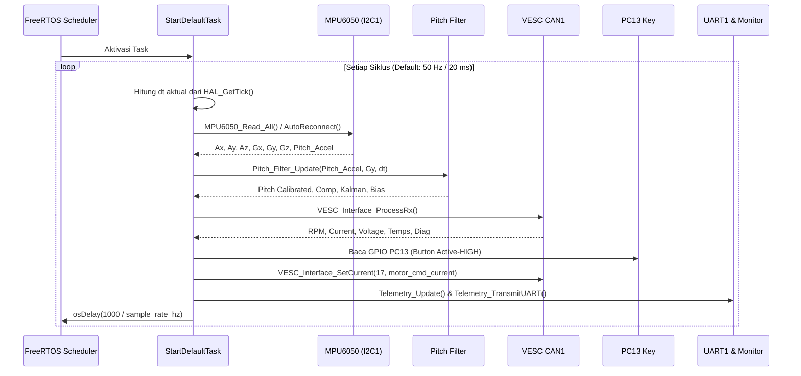

# Dokumentasi Arsitektur Firmware & Panduan Pengembangan Selanjutnya

Dokumen ini ditujukan sebagai **panduan teknis lengkap (technical handoff)** bagi perekayasa perangkat lunak atau AI assistant berikutnya yang akan melanjutkan pengembangan firmware **Hill-Up Control (Hill-Start Assist)** ini.

---

## 1. Ikhtisar Sistem & Status Proyek

- **Platform Target:** STM32F446RET6 (ARM Cortex-M4, clock 168/180 MHz, Flash 512 KB, SRAM 128 KB).
- **Aplikasi:** Sistem kendali Hill-Up Control / Hill-Start Assist pada prototipe kendaraan uji 10 kg dengan motor penggerak BLDC yang dikendalikan oleh controller VESC via CAN Bus.
- **Status Saat Ini:**
  - Telah direfaktorisasi dari file monolitik (`main.c` 761 baris) menjadi modul-modul terpisah (`.h` dan `.c`).
  - Loop kendali deterministik berjalan di dalam FreeRTOS task `StartDefaultTask`.
  - Frekuensi sampling dapat diatur dinamis melalui variabel `sample_rate_hz`.
  - Estimasi sudut pitch (Sensor Fusion) menggunakan kalibrasi tare, Complementary Filter, dan 2-State Kalman Filter telah aktif.
  - Komunikasi CAN Bus dua arah dengan VESC telah aktif (menerima telemetri dan mengirim perintah arus).
  - Telemetri terpusat di `System_Monitor_t monitor` untuk pemantauan STM32CubeIDE *Live Expressions* dan transmisi UART.

---

## 2. Arsitektur Modul Firmware

Firmware dibagi menjadi beberapa modul independen dengan tanggung jawab yang jelas (*Separation of Concerns*):

```
Core/
├── Inc/
│   ├── main.h                 # Definisi hardware umum CubeMX
│   ├── FreeRTOSConfig.h       # Konfigurasi kernel FreeRTOS
│   ├── mpu6050.h              # Header driver IMU MPU6050 (I2C)
│   ├── pitch_filter.h         # Header estimasi sudut pitch & Kalman 2-state
│   ├── vesc_can_protocol.h    # Protokol CAN biner VESC tingkat rendah (byte packing)
│   ├── vesc_interface.h       # Antarmuka tingkat tinggi CAN VESC & diagnostik bus
│   └── telemetry.h            # Struktur System_Monitor_t & transmisi serial UART
└── Src/
    ├── main.c                 # Inisialisasi perifer & orkestrasi FreeRTOS task
    ├── mpu6050.c              # Implementasi driver MPU6050
    ├── pitch_filter.c         # Implementasi Complementary & Kalman Filter
    ├── vesc_interface.c       # Implementasi penerimaan, transmisi, dan filter CAN
    └── telemetry.c            # Implementasi format string serial & transmit UART
```

### Rincian Modul & API Kunci

#### A. Driver MPU6050 (`mpu6050.h` / `mpu6050.c`)
- **Tanggung Jawab:** Berkomunikasi dengan sensor MPU6050 via I2C1 (Fast Mode).
- **Tipe Data:** `MPU6050_t` (menyimpan raw registers, nilai akselerasi $A_x, A_y, A_z$ dalam $g$, kecepatan sudut $G_x, G_y, G_z$ dalam $\text{deg/s}$, sudut `pitch_accel`, dan status koneksi `is_connected`).
- **Fungsi Kunci:**
  - `uint8_t MPU6050_Init(I2C_HandleTypeDef *hi2c, MPU6050_t *dev);`
  - `uint8_t MPU6050_Read_All(I2C_HandleTypeDef *hi2c, MPU6050_t *dev);`
  - `void MPU6050_AutoReconnect(I2C_HandleTypeDef *hi2c, MPU6050_t *dev, uint32_t now_ms, uint32_t interval_ms);`

#### B. Estimasi Pitch / Sensor Fusion (`pitch_filter.h` / `pitch_filter.c`)
- **Tanggung Jawab:** Menggabungkan akselerometer pitch dan gyro $Y$ untuk menghasilkan estimasi sudut yang stabil dan bebas drift.
- **Tipe Data:** `Pitch_Filter_t`.
- **Parameter Tuning:**
  - `pitch_offset = -7.9073f` (Zero-tare offset).
  - `alpha = 0.98f` (Bobot filter komplementer).
  - `Q_angle = 0.0010f`, `Q_bias = 0.0005f`, `R_measure = 0.0350f` (Kovarians noise Kalman).
- **Fungsi Kunci:**
  - `void Pitch_Filter_Init(Pitch_Filter_t *filter, float pitch_offset, float alpha, float q_angle, float q_bias, float r_measure);`
  - `void Pitch_Filter_Update(Pitch_Filter_t *filter, float raw_pitch, float gyro_y, float dt);`

#### C. Antarmuka VESC CAN (`vesc_interface.h` / `vesc_interface.c`)
- **Tanggung Jawab:** Abstraksi komunikasi CAN1 dengan VESC controller (ID default 17).
- **Tipe Data:** `VESC_Telemetry_t` (RPM, arus motor riil, duty cycle, tegangan baterai, suhu FET, suhu motor) dan `CAN_Diagnostics_t` (counter paket, error register `ESR`, `TEC`, `REC`, `BOFF`).
- **Fungsi Kunci:**
  - `HAL_StatusTypeDef VESC_Interface_InitCANFilter(CAN_HandleTypeDef *hcan);`
  - `void VESC_Interface_ProcessRx(CAN_HandleTypeDef *hcan, VESC_Telemetry_t *telemetry, CAN_Diagnostics_t *diag);`
  - `void VESC_Interface_SetCurrent(CAN_HandleTypeDef *hcan, uint8_t controller_id, float current);`

#### D. Telemetri & Monitor Sistem (`telemetry.h` / `telemetry.c`)
- **Tanggung Jawab:** Mengumpulkan seluruh parameter sistem ke dalam struktur tunggal `System_Monitor_t` untuk kemudahan debugging dan mengirimkan string telemetri ke UART1 (115200 baud).
- **Catatan Teknis:** Menggunakan format *integer breakdown* (`%d.%02d`) agar aman pada toolchain GCC Newlib-nano tanpa memerlukan flag `-u _printf_float` yang memboroskan memori flash.
- **Fungsi Kunci:**
  - `void Telemetry_Update(System_Monitor_t *mon, ...);`
  - `void Telemetry_TransmitUART(UART_HandleTypeDef *huart, const System_Monitor_t *mon);`

---

## 3. Alur Eksekusi Real-Time (FreeRTOS Task)

Loop utama sistem dijalankan di dalam fungsi `StartDefaultTask()` pada [main.c](file:///media/ricky/SSD/SKRIPSI/skripsi-hill-up-control-main/Core/Src/main.c):



### Variabel Sampling Rate Dinamis
Pada [main.c](file:///media/ricky/SSD/SKRIPSI/skripsi-hill-up-control-main/Core/Src/main.c):
```c
float sample_rate_hz = 50.0f;
```
Periode delay dihitung dinamis setiap iterasi loop:
```c
uint32_t delay_ms = (sample_rate_hz > 0.0f) ? (uint32_t)(1000.0f / sample_rate_hz) : 20;
osDelay(delay_ms);
```
Pengguna atau penguji dapat mengubah variabel `sample_rate_hz` langsung dari tab **Live Expressions** di STM32CubeIDE saat debugging.

---

## 4. Riwayat Masalah Kritis yang Telah Diperbaiki

Bila meninjau versi commit sebelumnya, berikut adalah perbaikan penting yang telah dilakukan:
1. **FreeRTOS Dead-Code Fix:** Pada kode lama, seluruh logika kendali berada di dalam `while(1)` di bawah `osKernelStart()`. Karena `osKernelStart()` tidak pernah kembali, kode tersebut tidak pernah dieksekusi. Kini seluruh logika berada di `StartDefaultTask`.
2. **Task Stack Size:** Stack task bawaan CubeMX (128 words / 512 bytes) dinaikkan menjadi **512 words (2048 bytes)** untuk mencegah *stack overflow* akibat pemanggilan `snprintf` dan operasi floating point.
3. **Clock Port GPIOC & PC13:** Sebelumnya pembacaan `HAL_GPIO_ReadPin(GPIOC, GPIO_PIN_13)` dilakukan tanpa mengaktifkan clock GPIOC di `MX_GPIO_Init()`. Clock `__HAL_RCC_GPIOC_CLK_ENABLE()` dan konfigurasi `GPIO_PULLDOWN` telah ditambahkan.
4. **Modularitas:** Fungsi-fungsi sepanjang ratusan baris di `main.c` telah didekomposisi menjadi 4 modul terpisah yang dapat diuji secara independen.

---

## 5. Rencana Kerja Selanjutnya (Roadmap for Next Developer / AI)

Bagi pengembang atau AI berikutnya yang melanjutkan repositori ini, berikut adalah daftar pekerjaan prioritas:

### 📌 Prioritas 1: Implementasi Algoritma Kendali Loop Tertutup (Closed-Loop Hill Assist)
- **Kondisi Sekarang:** Perintah arus ke VESC masih semi-manual melalui tombol PC13:
  ```c
  if (btn_pressed) {
    motor_cmd_current = 4.0f; // 4 Ampere saat ditekan
  } else {
    motor_cmd_current = 0.0f; // 0 Ampere saat dilepas
  }
  ```
- **Tugas Selanjutnya:**
  1. Buat modul baru `hill_controller.h` dan `hill_controller.c`.
  2. Implementasikan kalkulasi torsi penahan gravitasi berbasis sudut pitch kalman $\theta$:
     $$F_g = m \cdot g \cdot \sin(\theta)$$
     $$T_{req} = F_g \cdot r_{wheel} / G_{ratio}$$
     $$I_{cmd} = T_{req} / K_t$$
  3. Tambahkan state machine (kondisi tanjakan: *STOPPED*, *HOLDING*, *DRIVING_OFF*) untuk mencegah backward roll secara otomatis tanpa harus menekan tombol terus-menerus.

### 📌 Prioritas 2: Implementasi Pembacaan 4 Sensor IR untuk Slip Detection (EXTI)
- **Kondisi Sekarang:** Di `README.md` disebutkan keberadaan 4 sensor IR untuk mengukur RPM roda depan kiri/kanan dan mendeteksi slip, namun kode driver sensor IR tersebut **belum diimplementasikan** di firmware.
- **Tugas Selanjutnya:**
  1. Tentukan pin GPIO input yang digunakan untuk sensor optik/IR roda (misalnya pin EXTI pada Port B atau Port C).
  2. Konfigurasi interrupt EXTI di `stm32f4xx_it.c` atau via timer encoder mode.
  3. Buat modul `wheel_speed.h` & `wheel_speed.c` untuk menghitung RPM masing-masing roda dari interval waktu pulsa.
  4. Hitung rasio slip antara roda penggerak (dari VESC RPM) dan roda bebas (dari IR sensor).

### 📌 Prioritas 3: Peningkatan Komunikasi CAN Menggunakan Interrupt (CAN RX FIFO0 IRQ)
- **Kondisi Sekarang:** Pembacaan CAN masih menggunakan polling FIFO di dalam task 50 Hz:
  ```c
  while (HAL_CAN_GetRxFifoFillLevel(hcan, CAN_RX_FIFO0) > 0)
  ```
- **Tugas Selanjutnya:**
  1. Jika frekuensi paket status dari VESC sangat tinggi (misal > 100 Hz), pertimbangkan mengaktifkan interrupt CAN:
     `HAL_CAN_ActivateNotification(&hcan1, CAN_IT_RX_FIFO0_MSG_PENDING);`
  2. Implementasikan callback `HAL_CAN_RxFifo0MsgPendingCallback()` di `vesc_interface.c`.
  3. Gunakan FreeRTOS Queue atau Direct-to-Task Notification untuk mengirim data paket ke task controller.

### 📌 Prioritas 4: Kalibrasi Tare Otomatis (Auto-Zero Calibration)
- **Kondisi Sekarang:** `pitch_offset` di-hardcode ke `-7.9073f` berdasarkan hasil eksperimen sebelumnya.
- **Tugas Selanjutnya:**
  1. Tambahkan fungsi kalibrasi tare otomatis saat board baru menyala (ambil rata-rata 100 sampel saat sensor diam) atau saat tombol ditekan selama > 3 detik.
  2. Simpan nilai offset ke Flash memory (Emulated EEPROM) jika ingin nilai tare tetap tersimpan saat power mati.

---

## 6. Petunjuk Kompilasi & Debugging

1. **Buka STM32CubeIDE**, pilih menu `File -> Open Projects from File System...` dan pilih direktori root `skripsi-hill-up-control-main`.
2. Pastikan compiler mengenali path include:
   - `Core/Inc`
   - `Drivers/STM32F4xx_HAL_Driver/Inc`
   - `Middlewares/Third_Party/FreeRTOS/Source/include`
3. Tekan **Build** (`Ctrl + B`). Pastikan tidak ada error kompilasi.
4. Hubungkan ST-Link ke STM32F446RE dan pilih **Debug** (`F11`).
5. Buka view **Live Expressions** dan tambahkan variabel berikut:
   - `monitor` (dapat di-expand untuk melihat seluruh nilai sensor, filter, CAN, dan VESC).
   - `sample_rate_hz` (dapat diubah nilainya secara interaktif untuk menguji variasi frekuensi loop).
